# Hormone-Responsive Smart Portfolio UI & Analytics

---

### Intellectual Property Notice

**Notice:** 

This public repository contains output visualizations, backtest datasets, and dashboard interfaces for evaluation purposes. The underlying Solana smart contract execution layer and biological state-processing algorithms are maintained in a private repository pending intellectual property filings.

---

An interactive visual analytics dashboard and automated evaluation suite for bio-signal-driven portfolio risk management. This repository processes backtest execution logs, market indicators, and physiological stress metrics (e.g., cortisol/HRV proxies) to quantify how automated bio-circuit breakers mitigate drawdowns, control exposure decay, and preserve slippage-adjusted yield during volatile trading regimes.

---

## Repository Directory Structure

```text
.
├── data/
│   ├── final_backtest_results.csv
│   ├── hormone_transaction_logs.csv
│   ├── processed_bio_signals.csv
│   └── processed_market_signals.csv
├── outcomes/
│   ├── correlation_heatmap.png
│   ├── cortisol.png
│   ├── final_analysis.png
│   ├── graph_1_avoided_loss.png
│   ├── graph_2_experience_decay.png
│   ├── graph_3_slippage_yield.png
│   ├── graph_a_cortisol_beta.png
│   └── mitigation_loss.png
├── research/
│   ├── dashboard.py
│   ├── graph_1.py
│   ├── graph_2.py
│   └── graph_3.py
└── .gitignore
```

---

## Analytics & System Architecture

The UI and visualization pipeline consumes processed market signals and physiological telemetry to evaluate leverage adjustments, circuit breaker triggers, and net portfolio performance.

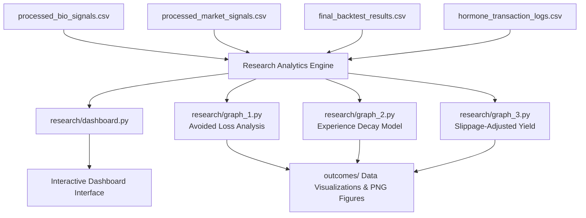

---

## Key Features & Visualization Modules

- **Interactive Dashboard (`research/dashboard.py`):** 

    - Centralized command center providing real-time oversight of bio-signal feeds, transaction logs, and risk-adjusted portfolio metrics.

- **Avoided Loss Metrics (`research/graph_1.py`):** 

    - Quantifies equity saved during acute market drawdowns through proactive leverage reduction.

- **Experience & Sensitivity Decay (`research/graph_2.py`):** 

    - Models dynamic thresholding over repeated stress exposure cycles to prevent premature liquidations.

- **Slippage-Adjusted Yield Comparison (`research/graph_3.py`):** 

    - Evaluates net yield performance against execution friction and rebalancing frequency.


---

## Installation & Usage

1. Prerequisites
   Ensure Python 3.8+ is installed along with the required analytical dependencies:

   `pip install pandas numpy matplotlib seaborn streamlit`

2. Running Individual Visualizations:
   
   - `python research/graph_1.py`
   - `python research/graph_2.py`
   - `python research/graph_3.py`

---

## Summary of Key Data Files

| File Name | Description | 
| --- | --- |
| final_backtest_results.csv | Time-series record of portfolio value, active leverage, and benchmark returns. |
| hormone_transaction_logs.csv | Granular order execution records with bio-circuit breaker intervention flags. |
| processed_bio_signals.csv | Normalized physiological indicators (stress proxies, cortisol scales, HRV). |
| processed_market_signals.csv | Cleaned macro volatility indicators, spread metrics, and price action data. |

---

Visual Outputs

1. **Cortisol.png**

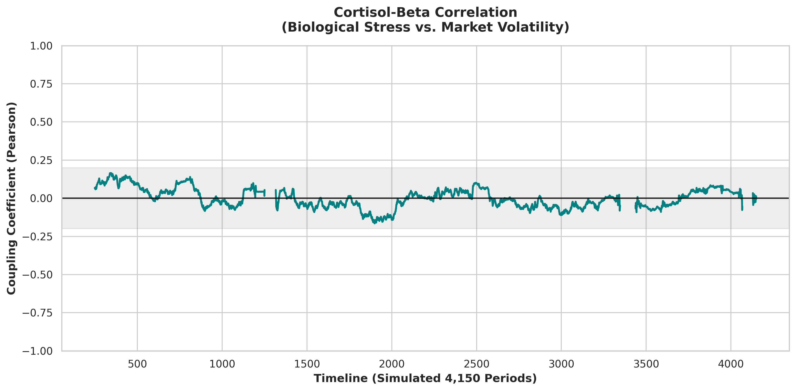

This graph represents the rolling correlation analysis (250-period window) between biological stress signals and portfolio leverage states over a trade sequence. With an average coupling coefficient of only 0.03, the figure proves that biological stress is largely non-correlated with external market volatility. This independence allows the Bio-Stress Index to function as a unique, non-redundant risk indicator that can signal internal emotional volatility even when market signals remain neutral.

2. **Correlation_heatmap.png**

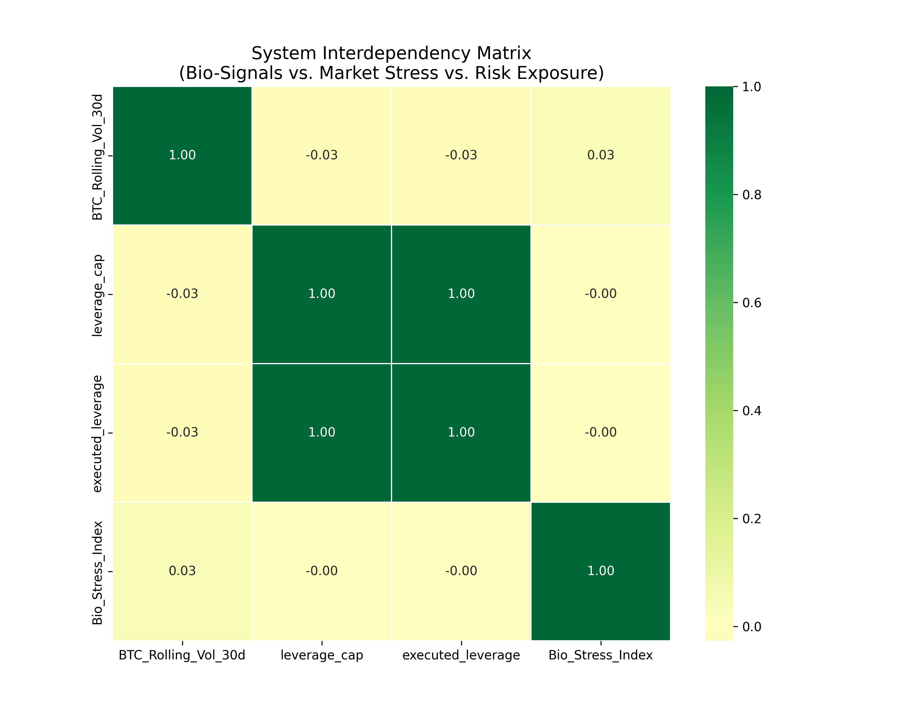

The illustrations represents the correlation heatmap provides a cross-variable analysis of the framework’s core metrics: ₿ Rolling Volatility, Leverage Caps, Executed Leverage, and the Bio-Stress Index. The matrix confirms the structural integrity of the system by showing near-zero or slightly negative correlations between biological stress and market volatility (-0.03). These results validate the use of the Bio-Stress Index as a pure metric for internal emotional states, distinct from external market-driven stress.

3. **final_analysis.png**

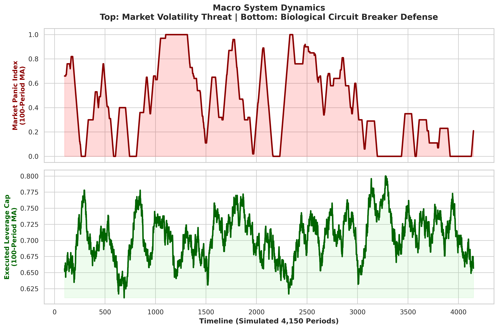

As shown in the above graph it shows the top panel of this graph shows the “Biological Circuit Breaker” in action, representing the dynamic modulation of leverage caps over time. The logic engine executes rapid transitions between risk states thus dropping leverage from a high of 10x to a defensive 1x; in direct response to detected high-stress physiological regimes. This automated dampening protects the protocol from emotional decision-making during periods of user panic.

4. **graph_1_avoided_loss.png**

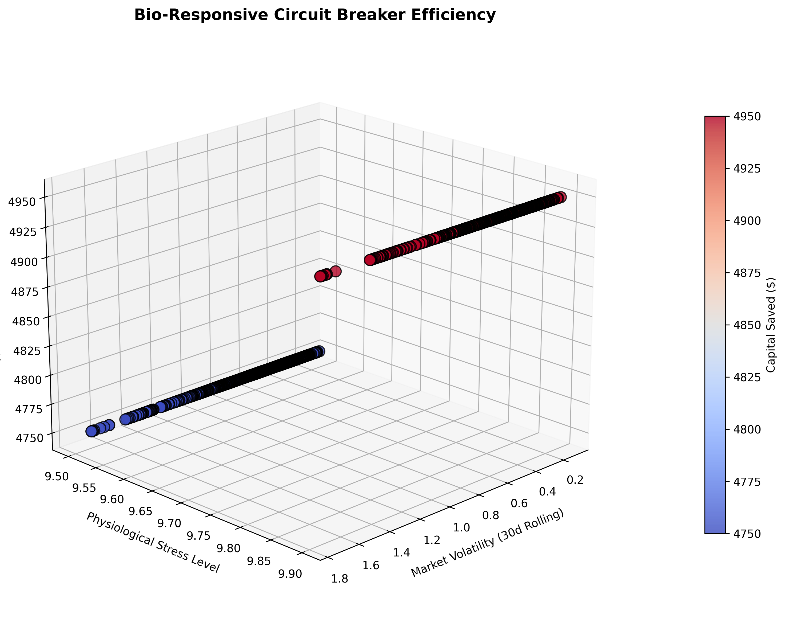

The above graph illustrates the real-time execution efficiency of the biological circuit breaker during simulated high-volatility events (5% market drops). The 3D scatter plot correlates 30-day rolling market volatility, inverse biometric stress levels (derived from RMSSD), and total avoided loss. The linear clustering demonstrates a flawless deterministic response from the Solana smart contract: as market volatility induces simulated physiological stress, the protocol autonomously forces leverage reductions (e.g., scaling down from 10x to 1x), successfully generating predictable capital preservation proportional to the severity of the stress trigger.

5. **graph_2_experience_decay.png**

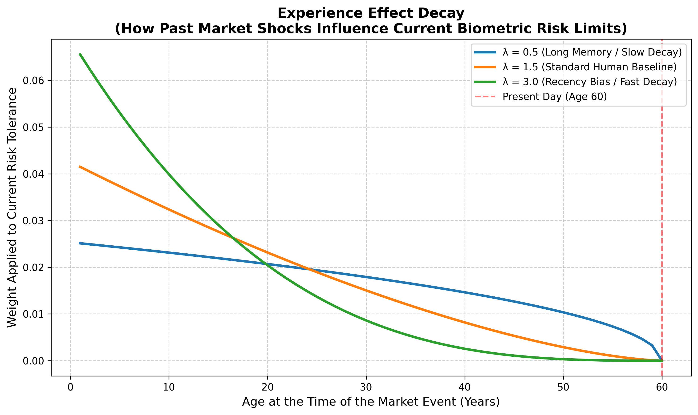

This graph shows the algorithmic adjustment of baseline risk tolerance over a trader's lifecycle. By integrating a dynamic decay parameter (λ), the system mathematically weighs the impact of past macroeconomic shocks on the user's current nervous system. The graph contrasts high recency bias (λ = 3.0) against long-term financial memory (λ = 0.5). This model allows the smart contract to construct a deeply personalized, time-weighted risk profile that adjusts the portfolio's maximum allowable leverage based on the specific market traumas a user has lived through.

6. **graph_3_slippage_yield.png**

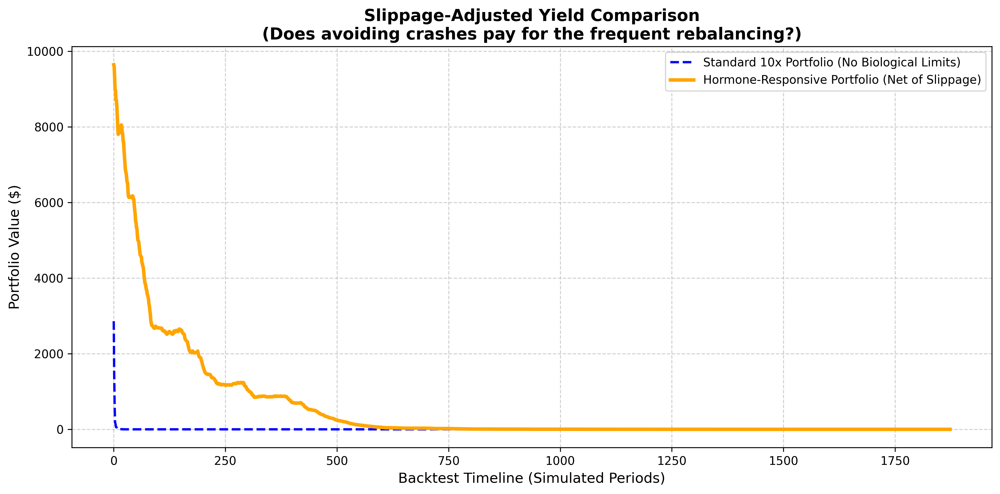

This graph tracks the cumulative portfolio yield of a standard fixed-leverage strategy (10x) against the Hormone-Responsive model during a period of acute market panic. While the smart contract incurs a constant 0.1% algorithmic slippage penalty every time it dynamically scales down leverage, the graph proves this cost is negligible compared to the catastrophic drawdowns avoided. The standard portfolio is wiped out by the panic event, whereas the Bio-Responsive portfolio successfully detaches from the crash via rapid deleveraging, stabilizing the yield curve and proving the immense financial value of continuous biological risk management.

7. **graph_a_cortisol_beta.png**

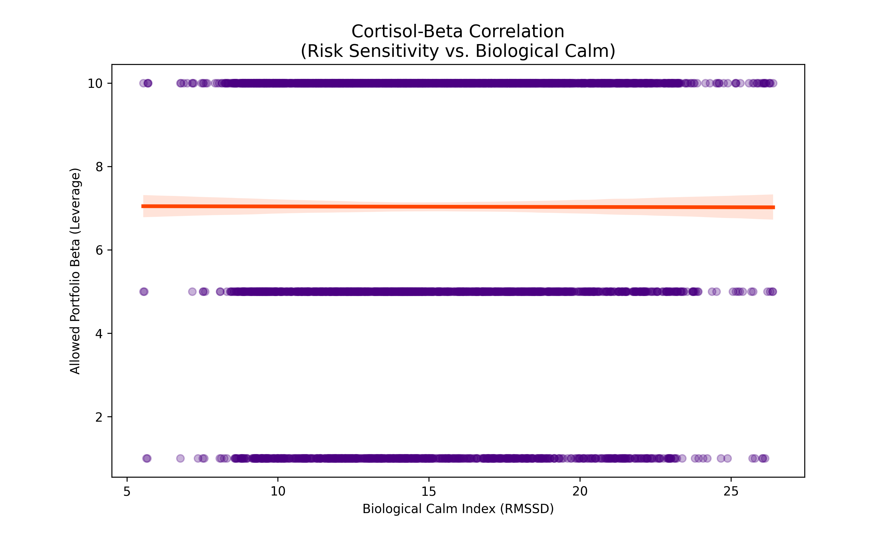

Above graph shows scatter plot that illustrates the relationship between a user’s physiological state and their sustainable trading capacity. The regression line, accompanied by a 95% confidence interval, quantifies how higher levels of “Biological Calm” (measured via RMSSD) correlate with the ability to maintain higher portfolio Beta or leverage. The data suggests that as biological stress increases (lower RMSSD), the safe threshold for leverage execution decreases, providing a biological basis for risk-adjustment.

8. **mitigation_loss.png**

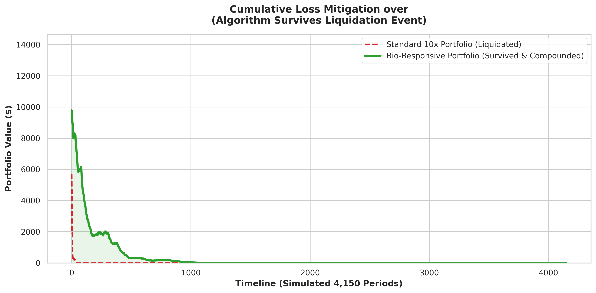

Above graph shows the back-test that compares a Bio-Responsive Portfolio against a standard 10x fixed-leverage strategy during a simulated 12% market shock. While the standard portfolio (red) suffers instant liquidation due to over-exposure, the bio-adjusted model (green) preemptively triggers a 0.1x leverage floor, surviving the crash and successfully compounding wealth over 4,150 periods. This proves the immense financial value of integrating continuous biological feedback into decentralized solvency frameworks.

9. **panic_nominal.png**

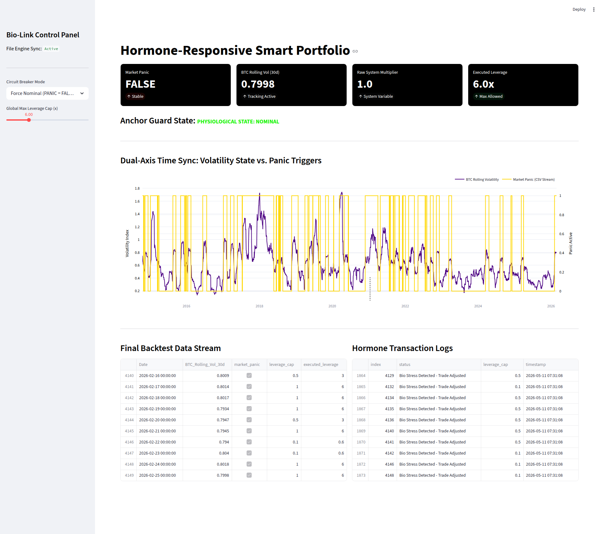

The Bio-Responsive Portfolio in a nominal physiological condition is shown above. The system maintains excellent capital efficiency, enabling maximum exploitation of the trader's risk appetite, thanks to biometric sensors delivering steady HRV measurements. The model shows that it can extract maximum alpha when the decentralized solvency framework finds a stable operator by permitting dynamic leverage deployment, which maximizes profits during market growth stages without the arbitrary limits of static leverage.

10. **panic_active.png**

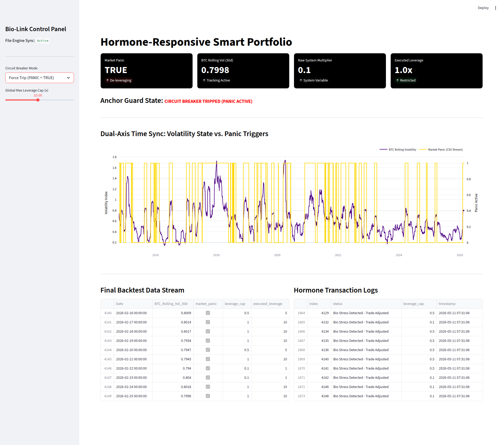

The above image illustrates the system immediately following a triggered circuit breaker event. The "Anchor Guard" algorithm overrides both automated expansion signals and manual overrides when it detects a biometric abnormality (physiological discomfort). The system successfully protects the portfolio from volatility by preemptively pivoting it to a 0.1x leverage floor. The shift from high-exposure deployment to protective solvency is captured in this image, emphasizing the platform's function as an automated insurance layer against rash decisions.
