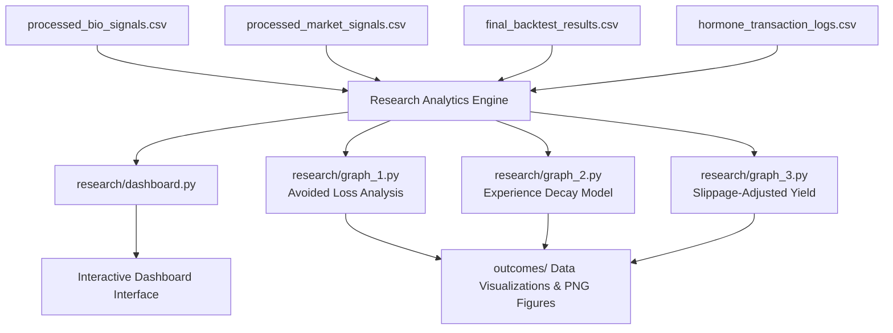

# Hormone-Responsive Smart Portfolio UI & Analytics

---

### Intellectual Property Notice

**Notice:** 

This public repository contains output visualizations, backtest datasets, and dashboard interfaces for evaluation purposes. The underlying Solana smart contract execution layer and biological state-processing algorithms are maintained in a private repository pending intellectual property filings.

---

An interactive visual analytics dashboard and automated evaluation suite for bio-signal-driven portfolio risk management. This repository processes backtest execution logs, market indicators, and physiological stress metrics (e.g., cortisol/HRV proxies) to quantify how automated bio-circuit breakers mitigate drawdowns, control exposure decay, and preserve slippage-adjusted yield during volatile trading regimes.

---

## Repository Directory Structure

```text
.
├── data/
│   ├── final_backtest_results.csv
│   ├── hormone_transaction_logs.csv
│   ├── processed_bio_signals.csv
│   └── processed_market_signals.csv
├── outcomes/
│   ├── correlation_heatmap.png
│   ├── cortisol.png
│   ├── final_analysis.png
│   ├── graph_1_avoided_loss.png
│   ├── graph_2_experience_decay.png
│   ├── graph_3_slippage_yield.png
│   ├── graph_a_cortisol_beta.png
│   └── mitigation_loss.png
├── research/
│   ├── dashboard.py
│   ├── graph_1.py
│   ├── graph_2.py
│   └── graph_3.py
└── .gitignore
```

---

## Analytics & System Architecture

The UI and visualization pipeline consumes processed market signals and physiological telemetry to evaluate leverage adjustments, circuit breaker triggers, and net portfolio performance.



---

## Key Features & Visualization Modules

- **Interactive Dashboard (`research/dashboard.py`):** 

Centralized command center providing real-time oversight of bio-signal feeds, transaction logs, and risk-adjusted portfolio metrics.

- **Avoided Loss Metrics (`research/graph_1.py`):** 

Quantifies equity saved during acute market drawdowns through proactive leverage reduction.

- **Experience & Sensitivity Decay (`research/graph_2.py`):** 

Models dynamic thresholding over repeated stress exposure cycles to prevent premature liquidations.

- **Slippage-Adjusted Yield Comparison (`research/graph_3.py`):** 

Evaluates net yield performance against execution friction and rebalancing frequency.


---

## Installation & Usage

1. Prerequisites
   Ensure Python 3.8+ is installed along with the required analytical dependencies:

   `pip install pandas numpy matplotlib seaborn streamlit`

2. Running Individual Visualizations:
   
   - `python research/graph_1.py`
   - `python research/graph_2.py`
   - `python research/graph_3.py`

---

## Summary of Key Data Files

| File Name | Description | 
| --- | --- |
| final_backtest_results.csv | Time-series record of portfolio value, active leverage, and benchmark returns. |
| hormone_transaction_logs.csv | Granular order execution records with bio-circuit breaker intervention flags. |
| processed_bio_signals.csv | Normalized physiological indicators (stress proxies, cortisol scales, HRV). |
| processed_market_signals.csv | Cleaned macro volatility indicators, spread metrics, and price action data. |


